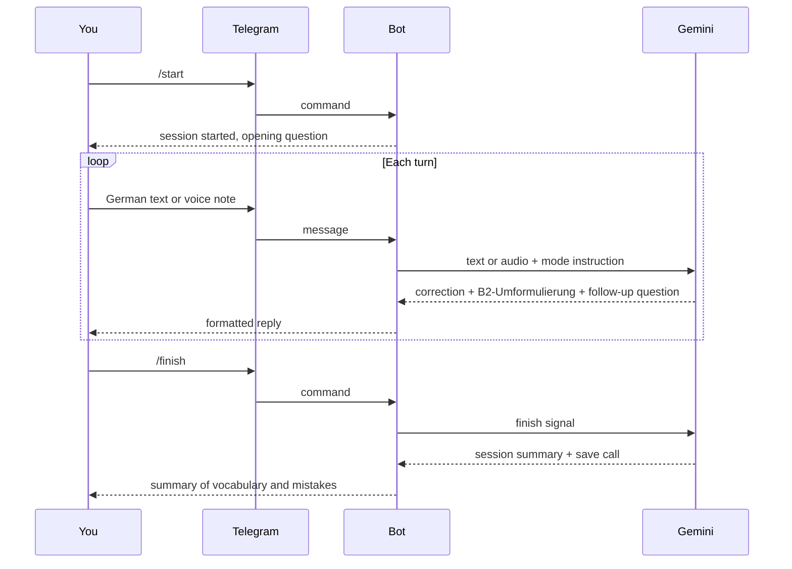
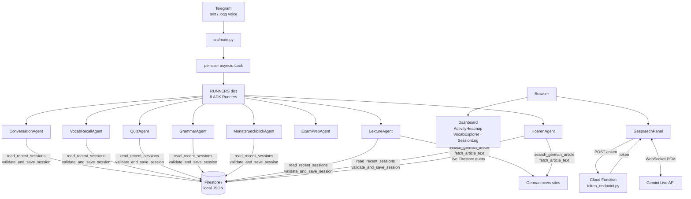

# deutsch-adk-coach — Guide

---

## 1. For Users

### What is this?

deutsch-adk-coach is a German B2 language coach on Telegram. Send it a text message or a voice note in German and it corrects your mistakes, rephrases your sentence at B2 level, and asks a follow-up question to keep the conversation going. A browser-based companion app shows your progress over time and lets you have a real-time voice call with the coach.

### Getting started

1. Open the bot in Telegram and send `/start` to begin a conversation session.
2. Write or speak in German — the coach responds with a correction and a question.
3. Send `/finish` when you are done to save your vocabulary and mistakes.

### Commands

| Command | What it does | When to use it |
|---|---|---|
| `/start` | Starts a new B2 conversation session | Any time you want to practise speaking or writing German |
| `/vocab` | Drills vocabulary you missed in recent sessions | When you want to revisit words you got wrong |
| `/quiz` | Runs a mistake-weighted quiz based on your error history | Friday — to review the week's recurring mistakes |
| `/grammatik` | Runs a grammar exercise on the topic most relevant to your recent errors | Mid-month structured grammar practice |
| `/bericht` | Generates your monthly progress report | First of each month — to see how the month went |
| `/pruefung` | Opens a telc B2 mock exam (writing, speaking, trap drill) | When preparing for the official B2 exam |
| `/lektuere` | Finds a real German news article and runs a reading comprehension session | When you want to practise reading authentic German |
| `/hoeren` | Finds a DW or Easy German audio episode and runs a listening + translation session | Sunday — to practise listening to native German |
| `/finish` | Ends the current session and saves your vocabulary and mistakes | At the end of any session |

### What a session looks like

Every coach reply in a conversation session (`/start`) follows this format:

```
🇩🇪 **Ich bin gestern ins Kino gegangen.**

🇬🇧 I went to the cinema yesterday.

---
⚠️ Mistake — Verbform: "Ich gehe gestern" → "Ich bin gestern gegangen" (Perfekt required for completed past events)

🇩🇪 **B2-Umformulierung:** Gestern Abend habe ich mir einen Film im Kino angesehen.

🇬🇧 Last night I watched a film at the cinema.

---
🇩🇪 **Wie hat dir der Film gefallen?**

🇬🇧 How did you like the film?
```

The B2-Umformulierung is a richer, B2-register rephrasing of what you said — it shows you how a fluent speaker would express the same idea.

The coach labels every mistake with one of 11 fixed categories (e.g. Verbform, Kasus, Wortstellung) so you can track which areas recur across sessions.

### Session flow



### Finishing a session

Send `/finish` at any point. The coach summarises:

- **Vocabulary** — nouns with article and plural, verbs with infinitive and Perfekt form, adjectives, idioms
- **Mistakes** — category, wrong form, corrected form, brief explanation
- **Stats** — number of turns, words produced, grammar features used (Konjunktiv II, Passiv, etc.)

The summary is saved to your history so future sessions (quiz, grammar, monthly report) can draw on it.

### Suggested weekly routine

The bot's built-in scheduler sends a prompt at these times (Europe/Berlin timezone):

| Day | Time | Session type | What it covers |
|---|---|---|---|
| Tuesday, Thursday | 09:00 | `/start` | Conversation practice |
| Friday | 09:00 | `/quiz` | Review recurring mistake categories |
| Sunday | 09:00 | `/hoeren` | Listening comprehension |
| 1st of month | 08:00 | `/bericht` | Monthly progress report |
| 10th of month | 09:00 | `/grammatik` | Grammar deep-dive |

You can send any command at any time outside of the schedule.

### Web companion

The web app shows:

- **Übersicht** — a calendar heatmap of your session activity and key stats
- **Vokabular** — all vocabulary from past sessions, searchable and sortable, with a gender-drill modal for nouns
- **Sitzungen** — a log of every saved session with drill-down into mistakes and vocabulary

**Gespräch** (German for "conversation") is a real-time voice call with the coach directly in the browser. Click the microphone button, speak German, and the coach responds with spoken corrections. No Telegram is needed. The session is saved to your history automatically when you end the call.

---

## 2. Security

### Voice notes (Telegram)

1. Telegram receives your voice note and stores it on their servers.
2. The bot downloads the `.ogg` bytes into memory. They are never written to disk.
3. The Gemini API receives the raw bytes plus a transcription instruction. It returns text only. Gemini does not retain the audio.
4. The text reply is sent back through Telegram. The audio bytes are discarded from memory.

Voice audio never touches Firestore or local storage.

### Gespräch audio (web companion)

1. The browser requests a short-lived credential from a Cloud Function (`POST /token`). The Gemini API key is never sent to the browser.
2. The browser opens a connection to the Gemini Live API using that credential.
3. Microphone audio is captured locally, sent as a stream, and discarded — it is not stored in the browser or on any server in this project.
4. Gemini returns spoken audio directly to the browser for playback. No audio is stored.
5. On hang-up, only the text session summary is saved to Firestore.

### Who can use the bot?

If `ALLOWED_TELEGRAM_USERS` is set, only those Telegram user IDs can interact with the bot. All others are silently ignored. If the variable is empty, anyone who finds the bot can use it.

---

## 3. For Developers

### Tech stack

| Layer | Technology |
|---|---|
| AI runtime | Google ADK 2.11.0 — `LlmAgent`, `Runner`, `InMemorySessionService` |
| AI model | Gemini 2.5 Flash (configurable via `GEMINI_MODEL`) |
| Bot framework | `python-telegram-bot` 21+ (async, long-polling) |
| Persistence | Cloud Firestore (production) or local JSON (development) |
| Web framework | Vite 6 + React 18 + TypeScript |
| Web persistence | Firebase JS SDK (live Firestore reads) |
| Real-time voice | Gemini Live API over WebSocket, AudioWorklet |
| Cloud Function | Python 3.11, `functions-framework` |
| Deployment | Cloud Run (bot), Firebase Hosting (web), Cloud Scheduler (crons) |

### Architecture



### File structure

```
deutsch-adk-coach/
├── src/
│   ├── main.py                    Telegram handlers, RUNNERS dict, _voice_content
│   ├── config.py                  Env var loading
│   ├── agents/
│   │   ├── conversation.py
│   │   ├── vocab_recall.py
│   │   ├── quiz.py
│   │   ├── grammar.py
│   │   ├── monthly_report.py
│   │   ├── exam_prep.py
│   │   ├── lekture.py
│   │   ├── hoeren.py
│   │   └── prompts.py             All 8 system prompts
│   ├── tools/
│   │   ├── firestore_tool.py      validate_and_save_session, read_recent_sessions
│   │   ├── web_search_tool.py     search_german_article
│   │   └── web_fetch_tool.py      fetch_article_text (SSRF-protected)
│   └── schemas/
│       └── session_schema.json
├── web/
│   └── src/
│       ├── components/
│       │   ├── ActivityHeatmap.tsx
│       │   ├── VocabExplorer.tsx
│       │   ├── SessionLog.tsx
│       │   └── GespraechPanel.tsx
│       └── hooks/
│           └── useSessions.ts
├── functions/
│   └── token_endpoint.py          Cloud Function: POST /token
├── deploy/
│   ├── cloud-run.yaml
│   └── scheduler.yaml
└── tests/                         42 pytest unit tests
```

### ADK runner pattern

Each agent is an `LlmAgent` paired with a `Runner`. A shared `InMemorySessionService` is used across all runners. The `RUNNERS` dict in `main.py` maps mode strings to runners:

```python
from google.adk.agents import LlmAgent
from google.adk.runners import Runner
from google.adk.sessions import InMemorySessionService
from src.agents.prompts import QUIZ_SYSTEM_PROMPT
from src.tools.firestore_tool import read_recent_sessions

quiz_agent = LlmAgent(
    name="quiz_agent",
    model=config.DEFAULT_MODEL,
    instruction=QUIZ_SYSTEM_PROMPT,
    tools=[read_recent_sessions],
)

session_service = InMemorySessionService()

quiz_runner = Runner(
    agent=quiz_agent,
    session_service=session_service,
    app_name="deutsch-adk-coach",
    auto_create_session=True,
)

RUNNERS = {
    "conversation": conversation_runner,
    "quiz":         quiz_runner,
    # ... 6 more
}
```

A turn is processed with:

```python
async for event in runner.run_async(
    user_id=str(user_id),
    session_id=session_id,
    new_message=content,
):
    if event.is_final_response() and event.content and event.content.parts:
        reply = "".join(p.text for p in event.content.parts if p.text)
```

### How to add a new agent

1. Write a system prompt in `src/agents/prompts.py`.
2. Create `src/agents/<skill>.py` with an `LlmAgent`:
   ```python
   from google.adk.agents import LlmAgent
   from src import config
   from src.agents.prompts import MY_SYSTEM_PROMPT
   from src.tools.firestore_tool import read_recent_sessions, validate_and_save_session

   my_agent = LlmAgent(
       name="my_agent",
       model=config.DEFAULT_MODEL,
       instruction=MY_SYSTEM_PROMPT,
       tools=[read_recent_sessions, validate_and_save_session],
   )
   ```
3. Create a `Runner` for it in `src/main.py` and add it to `RUNNERS` under a new mode key.
4. Add a branch in `_voice_content(audio_bytes, mode)` for the new mode.
5. Wire a `CommandHandler`:
   ```python
   async def mycommand(update, context):
       user_id = update.effective_user.id
       if not is_authorized(user_id): return
       user_mode[user_id] = "mymode"
       reset_session_id(user_id, "mymode")
       async with get_or_create_lock(user_id):
           runner, sid = RUNNERS["mymode"], get_or_create_session_id(user_id, "mymode")
           reply = await run_agent(runner, user_id, sid, ...)
           await update.message.reply_text(reply)

   app.add_handler(CommandHandler("mycommand", mycommand))
   ```
6. If the agent saves sessions, use a `type` value from the enum in `session_schema.json`.
7. If it runs on a schedule, add an entry to `deploy/scheduler.yaml`.

### How to add a new tool

1. Create `src/tools/<tool_name>.py` with a plain Python function — ADK tools require no decorator.
2. If the tool makes outbound HTTP requests, import `_ALLOWED_DOMAINS` from `web_fetch_tool.py` and validate the URL hostname before calling `urllib.request.urlopen`.
3. Add the function to `tools=[]` on every `LlmAgent` that needs it.

### Running locally

```bash
pip install -r requirements.txt
pytest                      # 42 unit tests
python test_agent_cli.py    # agent loop without Telegram
python -m src.main          # full bot (long-polling)

cd web && npm install && npm run dev   # web companion
```

---

## 4. For DevOps

### Prerequisites

| Requirement | Notes |
|---|---|
| Python 3.11+ | Bot and Cloud Function runtime |
| Node 18+ | Web companion build |
| Google Cloud project | Firestore, Cloud Run, Cloud Scheduler, Cloud Functions |
| Gemini API key | Google AI Studio (free tier) or Vertex AI |
| Telegram Bot Token | Create via @BotFather |
| `gcloud` CLI | Authenticated, project set |
| Firebase CLI | `npm install -g firebase-tools` |
| Google Custom Search API | Enable in GCP Console — required for `/lektuere` and `/hoeren` |
| Programmable Search Engine CX | Create at programmablesearchengine.google.com; copy the CX ID |
| Docker | For building the Cloud Run container image |

### Environment variables — bot

Copy `.env.example` to `.env`:

```env
GEMINI_API_KEY=your_key_here
TELEGRAM_BOT_TOKEN=your_token_here
GEMINI_MODEL=gemini-2.5-flash
GCP_PROJECT_ID=your_gcp_project
USE_LOCAL_STORAGE=false
ALLOWED_TELEGRAM_USERS=123456789,987654321
GOOGLE_SEARCH_API_KEY=your_search_key
GOOGLE_SEARCH_CX=your_cx_id
```

### Environment variables — Cloud Function

Set on the function (not in `.env`):

```env
GEMINI_API_KEY=your_key_here
GEMINI_MODEL=gemini-2.5-flash
```

### Environment variables — web companion

Set in `web/.env.local` before building:

```env
VITE_TOKEN_ENDPOINT=https://REGION-PROJECT.cloudfunctions.net/token_endpoint
VITE_FIREBASE_API_KEY=...
VITE_FIREBASE_PROJECT_ID=...
VITE_FIREBASE_APP_ID=...
```

### Bot deployment (Cloud Run)

```bash
gcloud builds submit --tag gcr.io/PROJECT_ID/deutsch-adk-coach
gcloud run services replace deploy/cloud-run.yaml --region europe-west1
gcloud run services update deutsch-adk-coach \
    --set-env-vars GEMINI_API_KEY=...,TELEGRAM_BOT_TOKEN=...
```

`maxScale: 1` and `containerConcurrency: 1` are set in `cloud-run.yaml` — one instance prevents split in-memory session state across instances.

### Cloud Function deployment

```bash
gcloud functions deploy token_endpoint \
    --runtime python311 \
    --trigger-http \
    --allow-unauthenticated \
    --region europe-west1 \
    --source functions/ \
    --entry-point token_endpoint \
    --set-env-vars GEMINI_API_KEY=...,GEMINI_MODEL=gemini-2.5-flash
```

### Web companion deployment (Firebase Hosting)

```bash
cd web
npm run build
firebase deploy --only hosting
```

Ensure `VITE_TOKEN_ENDPOINT` is set in `web/.env.local` before running `npm run build`, or inject it in your CI environment.

### Cloud Scheduler

```bash
# Tuesday + Thursday conversation (09:00 Berlin)
gcloud scheduler jobs create http deutsch-daily-practice \
    --schedule="0 9 * * 2,4" --time-zone="Europe/Berlin" \
    --uri="https://YOUR_CLOUD_RUN_URL/trigger/conversation" --http-method=POST

# Friday quiz (09:00 Berlin)
gcloud scheduler jobs create http deutsch-friday-quiz \
    --schedule="0 9 * * 5" --time-zone="Europe/Berlin" \
    --uri="https://YOUR_CLOUD_RUN_URL/trigger/quiz" --http-method=POST

# Sunday listening (09:00 Berlin)
gcloud scheduler jobs create http deutsch-sunday-listening \
    --schedule="0 9 * * 0" --time-zone="Europe/Berlin" \
    --uri="https://YOUR_CLOUD_RUN_URL/trigger/hoeren" --http-method=POST

# 1st of month — monthly report (08:00 Berlin)
gcloud scheduler jobs create http deutsch-monthly-report \
    --schedule="0 8 1 * *" --time-zone="Europe/Berlin" \
    --uri="https://YOUR_CLOUD_RUN_URL/trigger/bericht" --http-method=POST

# 10th of month — grammar (09:00 Berlin)
gcloud scheduler jobs create http deutsch-grammar \
    --schedule="0 9 10 * *" --time-zone="Europe/Berlin" \
    --uri="https://YOUR_CLOUD_RUN_URL/trigger/grammatik" --http-method=POST
```

See `deploy/scheduler.yaml` for the full spec including payload format.

### Observability

| Signal | Where to look |
|---|---|
| Bot errors | Cloud Run logs → filter `severity=ERROR` in Cloud Logging |
| Session saves | Firestore console → `users/{user_id}/sessions/` |
| Cloud Function errors | Cloud Functions logs in Cloud Logging |
| Web app errors | Browser DevTools console; Cloud Function logs for token failures |
| Scheduler job status | Cloud Scheduler console → job history |
