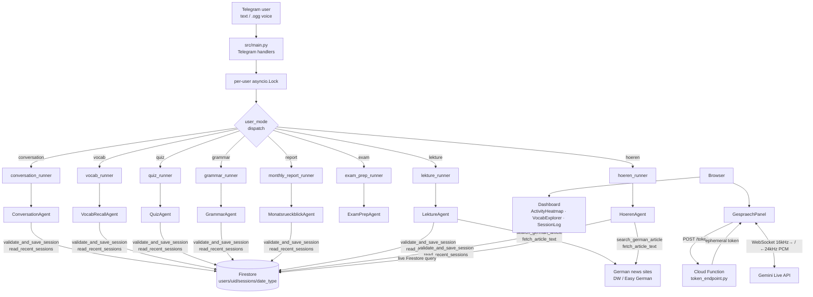
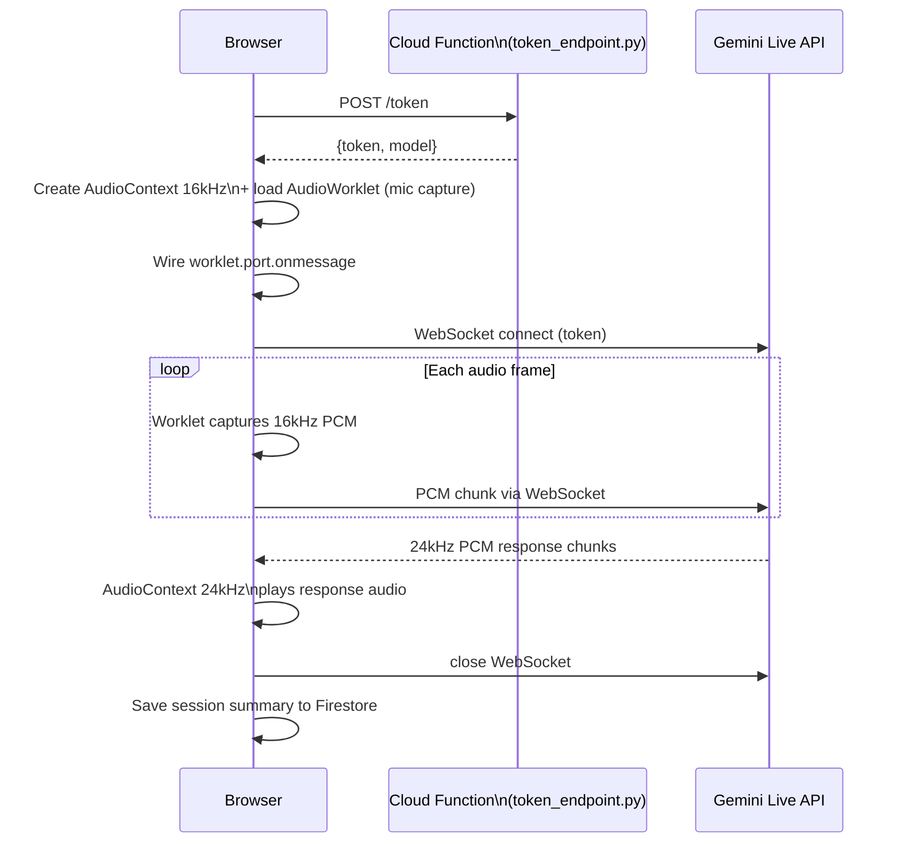

# deutsch-adk-coach — Architecture & Implementation Specification v3.0

---

## 1. Purpose

An event-driven German B2 language coach with two interfaces:

- **Telegram bot** — 8 specialised ADK agents handle conversation, vocabulary recall, quiz, grammar, monthly reporting, exam preparation, reading comprehension, and listening comprehension. Each Telegram command activates a different agent and its own ADK runner.
- **Web companion** — a Vite + React + TypeScript app with a live Firestore-backed progress dashboard and a real-time voice call panel (Gespräch) using the Gemini Live API.

Session telemetry from all agents is stored in a shared Firestore schema, so each agent can read history produced by the others.

---

## 2. System Overview



---

## 3. Components

### Backend

| File | Responsibility |
|---|---|
| `src/main.py` | Telegram handler routing; `RUNNERS` dict; `_voice_content`; per-user `asyncio.Lock`; `is_authorized` |
| `src/config.py` | Env var loading; `BASE_DIR`; `DEFAULT_MODEL` |
| `src/agents/conversation.py` | `ConversationAgent` — B2 conversation, 11 mistake categories, B2-Umformulierung |
| `src/agents/vocab_recall.py` | `VocabRecallAgent` — SRS noun-article + verb-infinitive drill |
| `src/agents/quiz.py` | `QuizAgent` — Fehler-Rewind (mistake-weighted) + Sticky Challenge |
| `src/agents/grammar.py` | `GrammarAgent` — 12-topic monthly rotation, 3 exercise types |
| `src/agents/monthly_report.py` | `MonatsrueckblickAgent` — 30-day aggregation, 3 focus areas |
| `src/agents/exam_prep.py` | `ExamPrepAgent` — telc B2 mock, no session save |
| `src/agents/lekture.py` | `LektureAgent` — search + fetch real article, 6 comprehension question types |
| `src/agents/hoeren.py` | `HoerenAgent` — search + fetch DW/Easy German, comprehension + translation |
| `src/agents/prompts.py` | All 8 system prompts |
| `src/tools/firestore_tool.py` | `validate_and_save_session`, `read_recent_sessions` — dual-destination (local JSON / Firestore) |
| `src/tools/web_search_tool.py` | `search_german_article` — Google Custom Search API wrapper with domain allowlist |
| `src/tools/web_fetch_tool.py` | `fetch_article_text` — SSRF-protected HTML fetch, strip, truncate at 6000 chars |
| `src/schemas/session_schema.json` | JSON Schema draft-07 shared data contract for all session types |

### Web companion

| File | Responsibility |
|---|---|
| `web/src/components/ActivityHeatmap.tsx` | Calendar heatmap of session activity |
| `web/src/components/VocabExplorer.tsx` | Searchable, sortable vocabulary table with gender-drill modal |
| `web/src/components/SessionLog.tsx` | Session list with drill-down into mistakes and vocabulary |
| `web/src/components/GespraechPanel.tsx` | Real-time voice call via Gemini Live API (WebSocket + AudioWorklet) |
| `web/src/hooks/useSessions.ts` | Firestore live query hook — rolling date window with server-side filter |

### Infrastructure

| File | Responsibility |
|---|---|
| `functions/token_endpoint.py` | Cloud Function — `POST /token` returns `{token, model}` with CORS; key never exposed to browser |
| `deploy/cloud-run.yaml` | Cloud Run service spec — `maxScale: 1`, `containerConcurrency: 1` |
| `deploy/scheduler.yaml` | Cloud Scheduler cron specs for all 5 automated sessions |
| `Dockerfile` | `python:3.11-slim`, `CMD python -m src.main` |
| `pytest.ini` | `testpaths = tests`, `asyncio_mode = auto` |

---

## 4. ADK Agent Architecture

### Runner pattern

Each agent is an `LlmAgent` instance wrapped in a `Runner`. All runners share one `InMemorySessionService`. The `RUNNERS` dict in `src/main.py` maps mode strings to runners:

```python
RUNNERS: dict[str, Runner] = {
    "conversation": conversation_runner,
    "vocab":        vocab_runner,
    "quiz":         quiz_runner,
    "grammar":      grammar_runner,
    "report":       monthly_report_runner,
    "exam":         exam_prep_runner,
    "lekture":      lekture_runner,
    "hoeren":       hoeren_runner,
}
```

Session IDs are scoped to `(user_id, mode)`. On each command invocation, `reset_session_id` generates a fresh `{mode}_{user_id}_{timestamp}` ID, starting a new ADK session context for that mode.

A turn is processed with:

```python
async for event in runner.run_async(
    user_id=str(user_id),
    session_id=session_id,
    new_message=content,
):
    if event.is_final_response() and event.content and event.content.parts:
        reply = "".join(p.text for p in event.content.parts if p.text)
```

### Agent tool assignments

| Agent | Tools |
|---|---|
| `ConversationAgent` | `validate_and_save_session` |
| `VocabRecallAgent` | `read_recent_sessions`, `validate_and_save_session` |
| `QuizAgent` | `read_recent_sessions` |
| `GrammarAgent` | `read_recent_sessions`, `validate_and_save_session` |
| `MonatsrueckblickAgent` | `read_recent_sessions`, `validate_and_save_session` |
| `ExamPrepAgent` | *(none — practice only, no save)* |
| `LektureAgent` | `search_german_article`, `fetch_article_text`, `validate_and_save_session` |
| `HoerenAgent` | `search_german_article`, `fetch_article_text`, `validate_and_save_session` |

### Voice dispatch

`_voice_content(audio_bytes, mode)` returns a `google.genai.types.Content` with two parts: the audio blob and a mode-specific text instruction. The instruction tells the model how to interpret the voice note in the current pedagogy context.

| Mode | Instruction intent |
|---|---|
| `conversation` | Transcribe, then apply full B2-Umformulierung correction cycle |
| `quiz` | Transcribe and treat as the learner's quiz answer |
| `grammar` | Transcribe and treat as the learner's grammar exercise answer |
| `exam` | Transcribe and evaluate register, B2 structure, fluency |
| `lekture`, `hoeren` | Transcribe and treat as the learner's reading or listening response |
| `vocab`, `report` (else) | Transcribe and treat as a drill answer |

---

## 5. Session Schema

Defined in `src/schemas/session_schema.json` (JSON Schema draft-07). All agents call `validate_and_save_session` with a dict conforming to this schema.

### Required fields

| Field | Type | Notes |
|---|---|---|
| `date` | string | `YYYY-MM-DD`; `MonatsrueckblickAgent` uses `YYYY-MM-01` |
| `type` | enum | `conversation \| listening \| writing \| reading \| grammar \| review \| vocab` |
| `name` | string | Human-readable session title |

### Optional arrays

| Field | Element shape |
|---|---|
| `nouns` | `{word, article, plural, meaning}` |
| `verbs` | `{infinitive, perfekt, meaning}` |
| `adjectives` | `{word, meaning}` |
| `idioms` | `{phrase, meaning}` |
| `mistakes` | `{category, wrong, right, explanation}` |
| `vocab_review_misses` | `string[]` — words missed in drill sessions; read by `VocabRecallAgent` and `QuizAgent` |

### Mistake categories (11 fixed values)

`Artikel/Genus`, `Kasus`, `Wortstellung`, `Verbform`, `Präposition`, `Wortwahl`, `Vokabular`, `Rechtschreibung`, `Komposition`, `Anglizismus/False Friend`, `Sonstiges`

### Stats fields by session type

| Field | Session type |
|---|---|
| `Anzahl Antworten`, `Wörter insgesamt`, `Sitzungsdauer (Minuten)` | conversation |
| `Komplexe Sätze`, `Konjunktiv II`, `Passiv`, `Genitiv` | conversation |
| `Hörverstehen (richtig/gesamt)` | listening |
| `Leseverstehen (richtig/gesamt)`, `Wörter im Artikel`, `source_url` | reading |
| `Lückentext richtig`, `Umformung richtig`, `Freie Sätze` | grammar |
| `Sitzungen gesamt`, `Neue Vokabeln`, `Wiederverwendungsrate (%)` | review |

---

## 6. Firestore Layout

```
Firestore
└── users/
    └── {telegram_user_id}/
        └── sessions/
            ├── 2026-10-03_conversation
            ├── 2026-10-03_quiz          ← same day, different type — no overwrite
            ├── 2026-10-01_reading
            └── 2026-10-01_listening
```

Document ID format: `{YYYY-MM-DD}_{type}`. This prevents overwrite when a user runs more than one session type on the same day.

`MonatsrueckblickAgent` saves with `date=YYYY-MM-01` to anchor monthly reviews to the first of the month regardless of when `/bericht` is actually run.

### Web companion query

`useSessions.ts` uses a server-side date filter to avoid full-collection scans:

```typescript
const q = query(
  collection(db, "users", USER_ID, "sessions"),
  where("date", ">=", cutoffStr),  // rolling window, e.g. 90 days
  orderBy("date", "desc"),
);
```

---

## 7. Web Companion Architecture

### Gespräch audio pipeline



### Key implementation decisions

| Decision | Reason |
|---|---|
| Two separate `AudioContext` refs — `micCtxRef` (16kHz) and `outCtxRef` (24kHz) | The Gemini Live API requires 16kHz PCM input and delivers 24kHz PCM output. A single `AudioContext` cannot run at two sample rates. Reassigning the ref mid-call would orphan the mic worklet and drop inbound audio. |
| `worklet.port.onmessage` is wired immediately after `addModule()`, before `new WebSocket()` | If the handler is wired inside `ws.onmessage` (on first server response), mic audio captured during the WebSocket handshake is silently dropped. |
| `ws.onclose` uses a functional `setStatus` updater | `status` is captured by closure at WebSocket creation time. When `onclose` fires, that closure value is stale. `setStatus(prev => prev === "live" \|\| prev === "connecting" ? "ended" : prev)` reads the actual current React state instead. |
| `buf.getChannelData(0).set(chunk)` instead of `buf.copyToChannel(chunk, 0)` | TypeScript 5 rejects `Float32Array` derived from a `SharedArrayBuffer` in the `copyToChannel` signature. `getChannelData` + `set` avoids the type mismatch. |

### SSRF protection in web tools

`fetch_article_text` and `search_german_article` only operate on an explicit allowlist of German news domains:

```
tagesschau.de  spiegel.de  heise.de  handelsblatt.com
dw.com  easygerman.org  zdf.de  sz.de
```

`_ALLOWED_DOMAINS` is defined once in `web_search_tool.py` and imported by `web_fetch_tool.py`. The hostname check runs before any `urllib.request.urlopen` call — no network request is made to a non-allowlisted domain, regardless of what URL the model passes as an argument.

---

## 8. Concurrency Model

| Layer | Mechanism |
|---|---|
| Cloud Run instance count | `maxScale: 1` — one instance; prevents in-memory `user_mode` and `user_session_ids` dicts from being split across instances |
| Request concurrency | `containerConcurrency: 1` — one webhook request processed at a time |
| Per-user serialisation | `asyncio.Lock` per Telegram user ID — rapid messages are queued, not interleaved |
| Session ID scoping | `(user_id, mode)` key — a user's quiz session and conversation session are independent ADK session contexts |

---

## 9. Environment Variables

| Variable | Required | Default | Used by |
|---|---|---|---|
| `GEMINI_API_KEY` | Yes | — | Bot (all agents), Cloud Function |
| `TELEGRAM_BOT_TOKEN` | Yes | — | Bot |
| `GEMINI_MODEL` | No | `gemini-2.5-flash` | Bot, Cloud Function |
| `GCP_PROJECT_ID` | No | — | Bot (Firestore); absence triggers local JSON storage |
| `USE_LOCAL_STORAGE` | No | `false` | Bot (force local JSON even when GCP is set) |
| `ALLOWED_TELEGRAM_USERS` | No | *(open)* | Bot (comma-separated Telegram user IDs) |
| `GOOGLE_SEARCH_API_KEY` | No* | — | `LektureAgent`, `HoerenAgent` |
| `GOOGLE_SEARCH_CX` | No* | — | `LektureAgent`, `HoerenAgent` |
| `VITE_TOKEN_ENDPOINT` | Build-time | — | Web companion (Cloud Function URL) |
| `VITE_FIREBASE_*` | Build-time | — | Web companion (Firebase SDK config) |

\* Required for `/lektuere` and `/hoeren` to function; both agents return `{"error": ...}` if either key is absent.

---

## 10. Deployment

See [docs/guide.md — For DevOps](guide.md#4-for-devops) for step-by-step commands.

| Component | Platform | Entry point |
|---|---|---|
| Bot | Cloud Run | `python -m src.main` |
| Token endpoint | Cloud Functions gen2 | `functions/token_endpoint.py::token_endpoint` |
| Web companion | Firebase Hosting | `npm run build` → `firebase deploy --only hosting` |
| Cron triggers | Cloud Scheduler | 5 jobs posting to Cloud Run `/trigger/*` routes |

---

## 11. Instructions for Claude Code

When implementing features in this repo:

- **New agents** use `LlmAgent` from `google.adk.agents`. Export the agent instance; create a `Runner` for it in `src/main.py`; add it to `RUNNERS` under a new mode key.
- **New commands** require: (1) entry in `RUNNERS`, (2) branch in `_voice_content` for the new mode, (3) `CommandHandler` in `src/main.py`, (4) entry in `deploy/scheduler.yaml` if cron-driven.
- **New HTTP tools** must validate the request URL hostname against `_ALLOWED_DOMAINS` from `web_fetch_tool.py` before any `urllib.request.urlopen` call. This applies to every tool that accepts a URL argument from the model.
- **Session saves** must use a `type` value from the enum in `src/schemas/session_schema.json`. Do not invent new type strings.
- **Tests** go in `tests/`. `asyncio_mode = auto` in `pytest.ini` means async test functions do not need `@pytest.mark.asyncio`.
